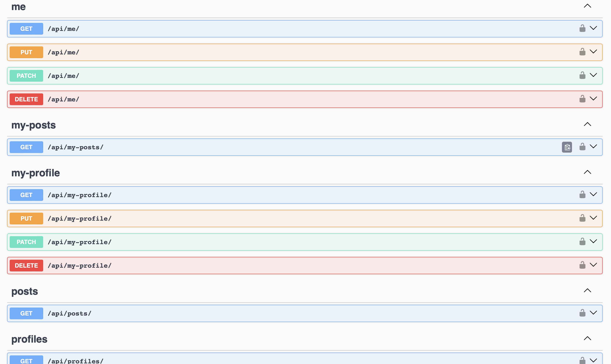

# Social-media-API

## Run with Docker

1. You need to install docker and run next: 
   ```bash
   docker pull artemh59/social-media-api
   docker run artemh59/social-media-api
   ```
   
## Accessing API:
1. `
Creating user:
/api/register/
`


2. `
Get access token:
/api/token/
`
</br>
</br>
</br>
After registering you will be able to interact with everyone API
</br>
</br>
